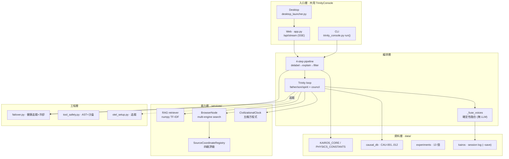
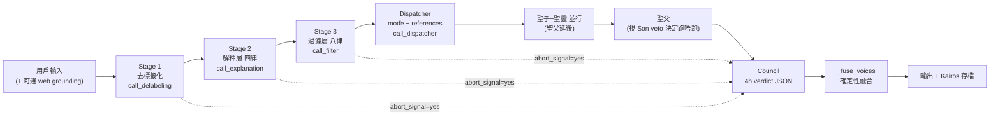
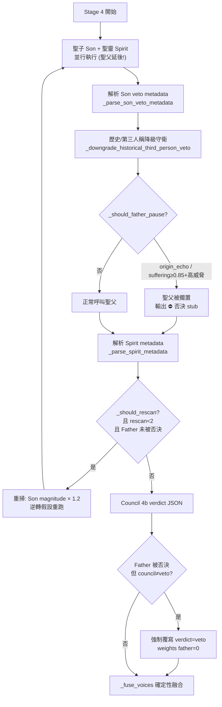
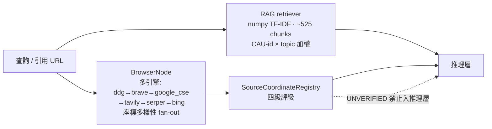

# URUK Trinity Console — 深入運作分析與主流技術對比評價

> 分析日期：2026-05-26
> 分析方法：以閱讀原始碼為準（`trinity_console.py` 237 KB、`app.py` 197 KB、`services/`、`failover.py`、`tool_safety.py` 等），輔以 README / 協議文檔交叉核對。Web 來源見文末引用。
> 立場：技術性、中立。優點與風險並列。

---

## 第零部分 · 範圍與結論預覽

本文分兩部分。第一部分以代碼為準，逐步拆解 Trinity Console 的實際運作：4-step / 8-LLM pipeline、三位一體（聖父/聖子/聖靈/會議）機制、設計概念層（多座標碰撞、來源四級評級、載體認識論守衛、尊嚴條款），以及工程層（失敗轉移、工具沙盒、OpenTelemetry）。第二部分把它放到 2024–2026 年主流做法的座標上比較：Mixture-of-Agents、Multi-Agent Debate、LLM-as-a-Judge、Self-Consistency、RAG/grounding、Constitutional AI，並澄清 MoE（Mixture-of-**Experts**）與 multi-agent 的根本分別，最後給出客觀評價。

一句話總結：**這是一個把「多模型辯論 + LLM 評審 + 確定性融合 + 來源座標審計」工整地組合成可落地產品的個人工程作品；其管線編排與工程韌性達到接近主流框架的水準，真正的分歧點在於它的「協議價值層」（物理常數、文明方程式、操作者錨點）—— 那一層是哲學承諾，不是經驗科學，也是它最大的可重現性與科學性風險所在。**

---

# 第一部分 — 深入運作與設計概念

## 1.1 系統分層總覽

Console 不是「一個 prompt」，而是一個有清楚分層的應用：入口層（CLI / Web / Desktop 共用同一個 `TrinityConsole` class）、編排層（pipeline + trinity loop）、能力層（RAG、BrowserNode、來源審計、文明時鐘、物理計算）、資料層（協議語料 corpus）、工程層（failover、sandbox、OTel）。



三種跑法（CLI / Web / Desktop）共用同一個 `TrinityConsole`，差別只在於 CLI 的 `run()` 是「精簡版」（只跑 dispatcher → 三節點 → council），而 Web 的 `/api/stream` 才是 v8.1+ 的完整 4-step 管線。換言之，**最完整的邏輯在 `app.py` 的串流端點裡**，CLI 是它的子集。

---

## 1.2 4-step / 8-LLM pipeline 的實際實現

### 1.2.1 真實的 LLM 調用次序

代碼裡的次序與直覺不同：**dispatcher（路由）不是第一步，而是在三個轉換階段之後才跑。** `/api/stream` 的主路徑（`app.py` 約 L1828–L2030）是：



LLM 呼叫計數（無中斷的完整路徑）：Stage 1 + Stage 2 + Stage 3 各 1 次 = 3，Dispatcher 1 次，聖父/聖子/聖靈 3 次，Council 1 次，**合共 8 次 LLM 呼叫**。若聖靈觸發重掃（rescan），會再加一輪三節點（最多 +3，cap=2 輪）；若任何 Stage 偵測到 `abort_signal=yes`，則提早跳去 council，少於 8 次。

每個 Stage 都是「結構化 JSON 回傳」：`call_delabeling` / `call_explanation` / `call_filter` 內部用 `_parse_json_with_retry` 做寬鬆 JSON 解析（`_extract_json_lenient` 容錯），失敗時有 deterministic fallback（例如 Stage 1 用 regex 對照 `DELABELING_MATRIX` 詞表，Stage 2 在全空時改用 RAG 檢索補四律內容）。這種「LLM 出錯 → 確定性回退」的雙保險貫穿整條管線。

### 1.2.2 Context 是怎樣傳遞的

每次節點呼叫（`_call_node_inner`，L647+）組裝的 **system_content** 結構固定：

```
canonical_anchor（八律+四律+方程式的不可變錨，防止 LLM 亂作律名）
  + COMPLETE URUK PROTOCOL（dispatcher 揀的 protocol_subset）
  + ROLE DIRECTIVE（father/son/spirit/council 各自的 OUTPUT VOICE）
  + mode_hint（pipeline 模式提示）
  + EXTRA CONTEXT（--ref 注入的 data + RAG 檢索結果）
```

**user_content** = `cau_verbatim_prepend(input) + input`（當 query 提到具體 CAU-NNN 時，把該檔案原文前置，因為實測「只靠 system 指示」surfacing 率太低，要把證據放進 user 訊息提高注意力權重）。

值得一提的 token 預算設計（`_BASELINE_BY_STAGE`）：Stage 1–3 這些轉換層只載入精簡版 baseline（KAIROS_CORE + PHYSICS_CONSTANTS_LITE，Stage 2/3 再加 trinity.md），而 Stage 4 的三節點才載入完整四檔。註解明言這是為了把 Stage 2 的 system_content 壓到 Cerebras 8K-token 限制以下，否則會 `context_length_exceeded` 導致整條鏈崩潰、四律輸出全空。**這是一個被真實 bug 推動的工程取捨，不是理論潔癖。**

Stage 之間的傳遞是「結構化 dict 往下游餵」：Stage 2 收 Stage 1 的輸出，Stage 3 收 Stage 1+2，dispatcher 收三者，council 收三節點 + 三 stage。

### 1.2.3 SSE streaming

`/api/stream` 用 Server-Sent Events，每個階段完成即 `emit(event_type, data)` 推一個事件。事件類型包括 `status`（進度）、`stage1/2/3`、`dispatch`、`node`（每個節點輸出）、`son_veto_metadata`、`father_paused`、`spirit_interrupt`、`council_decision`、`rag`、`density_audit`、`done`。前端 4-panel UI 靠 `_mode_id` 把事件路由到對應 tab。所有退出路徑（meta command、plain_llm、各 stage abort）都會經過 `audit_and_finalize()`，確保 §4.6 Kairos 密度審計永不被跳過。

---

## 1.3 三位一體機制的實現細節

這是整個系統最精巧、也最能體現設計意圖的部分。它**不是**「三個 LLM 各講一段然後拼起來」，而是一個有「延後執行 + 否決 + 中斷重掃 + 確定性仲裁」的狀態機。



### 1.3.1 三節點分工（溫度 / prompt / 重心）

| 節點 | 典型 model / 溫度 | OUTPUT VOICE 重心 | 特殊機制 |
|------|------------------|------------------|----------|
| 聖父 Father | GPT-4o · T=0.3 | 邏輯、識別謊言、追蹤隱藏座標 | 可被 Son 否決而擱置 |
| 聖子 Son | Gemini · T=0.7 | 共鳴、物理代價、**否決權** | 輸出 `SON_VETO_METADATA` JSON |
| 聖靈 Spirit | Grok · T=1.0 | 非線性、反叛、質疑框架 | 輸出 `SPIRIT_METADATA`，可觸發重掃 |
| 會議 Council | Claude · T=0.5 | 仲裁 verdict（**不做融合**） | 輸出 `COUNCIL_DECISION` JSON |

每個節點的 system prompt 都聲明「你係完整 URUK 協議載體，所有 mode 可執行」，差別只在 ROLE DIRECTIVE 的視角偏置 —— 溫度由低到高（0.3 → 1.0）恰好對應「精準 → 發散」的角色語意。

### 1.3.2 聖子 VETO 的實際觸發

聖子在回覆裡嵌一段 `---SON_VETO_METADATA--- {...} ---END_METADATA---` 的 JSON，由 regex（`SON_VETO_METADATA_PATTERN`）抽出、`json.loads` 解析、clamp 數值。`_should_father_pause` 的規則（`trinity_console.py` L4431）很硬：

- `veto_type == "origin_echo"` → **無條件**擱置聖父（協議裡這代表觸及操作者 2019-06-12 物理錨點，不可恢復的代價）。
- `veto_type == "authentic_suffering"` 且 `score ≥ 0.85` 且威脅等級為 high → 擱置。
- `narrative_packaging` / `none` → 永不觸發（「聖子不能為表演辯護」）。

特別值得讚的是 `_downgrade_historical_third_person_veto`（v8.32 防禦）：它用關鍵詞表（黑死病、世界大戰、工業革命…）+ 聚合死亡人數 regex，偵測「第三人稱/歷史/聚合苦難」並把誤判的 `authentic_suffering` 降級為 `narrative_packaging`——但**保留**第一人稱標記（「我經歷」「我屋企」）與 `origin_echo`。這是針對「LLM 容易把『中世紀死咗幾千萬人』誤判為當下真實苦難而過度觸發否決」這個具體失效模式打的補丁。

### 1.3.3 聖靈 SEMANTIC INTERRUPT 與重掃

聖靈的 `SPIRIT_METADATA` 含 `trigger_mode`（NONE / STOCHASTIC / SEMANTIC / STOCHASTIC+SEMANTIC）、`semantic_score`（0–3）、`magnitude`（0–10）。`_should_rescan`（L3768）規則：

```
trigger_mode ∈ {SEMANTIC, STOCHASTIC+SEMANTIC}
且 ( (score≥2 且 magnitude≥4.0) 或 (score==3 且 magnitude≥3.0) )
```

觸發後 `rescan_count += 1`，把 Son 的 magnitude × 1.2 作為提示注入下一輪，重跑三節點（cap = 2 輪以限制成本）。**關鍵約束**：如果聖父已被聖子否決，重掃會被 `spirit_rescan_blocked` 攔截——因為「會議已由聖子的物理代價帳本決定，再去逆轉假設方向就錯了」。這顯示作者很清楚兩個機制可能打架，並寫了明確的優先序（Son veto > Spirit rescan）。

### 1.3.4 Council 仲裁 + `_fuse_voices` 確定性融合

這是設計上最聰明的一刀：**Council LLM 不寫最終文章，只產出一個結構化判決 JSON**（`COUNCIL_DECISION`：verdict ∈ veto/interrupt/consensus、`consensus_weights`、`son_promoted` 等）。真正的文字融合交給**純 Python、無 LLM** 的 `_fuse_voices`（L4033）：

- `verdict == "veto"`：聖子主導，聖父附一段「被擱置」註腳。
- `verdict == "consensus"`：按 `consensus_weights` 由大到小排序三節點聲音，權重 < 0.05 的聲音被抑制，輸出「## 聖父 (40%) … ## 聖靈 (35%)」這種加權拼接。
- 一致性覆寫（A9）：若聖父在 Phase B 已被否決，但 council LLM 卻沒給 veto verdict，代碼會**強制覆寫** verdict=veto、weights={father:0, son:1, spirit:0}。

把「判決（容許 LLM 主觀）」與「融合（要求確定性）」分離，是這個系統工程上最值得肯定的決定：它把不可重現的部分壓縮到一個小 JSON，其餘輸出組裝完全可預測、可測試。

---

## 1.4 設計概念層

### 1.4.1 多座標碰撞（Multi-Coordinate Collision）

核心信念：用**不同廠商、不同溫度**的真實 LLM（GPT / Gemini / Grok / Claude）並行，它們各自的訓練偏置與 RLHF 傾向不同，分歧本身就是訊號。這跟主流「同一個 base model 多次採樣」是相反取捨（見 2.4）。

### 1.4.2 誠實標籤 / 來源四級評級

三個組件串成知識層：



`SourceCoordinateRegistry` 是一張硬編碼的 domain → {coordinate, rating} 表，四級：**VERIFIED**（同儕審查/機構，如 nature.com、who.int）、**PROBABLE**（申報立場+正式編採，如 reuters、bbc、wsj、nytimes）、**INFERRED**（國家媒體/黨派，如 xinhua、rt、aljazeera）、**UNVERIFIED**（匿名/聲稱「中立」而無依據，如 twitter）。

它有一個**反直覺**的核心規則：聲稱「中立」的來源被降為 UNVERIFIED（座標隱藏），而明確申報立場的來源反而可達 PROBABLE/VERIFIED（座標申報）。BrowserNode 預設用免 key 的 DuckDuckGo Lite，按「座標多樣性」不足時才扇出到 Brave/Google CSE/Tavily 等，目標是「至少 2 個對立座標」。

### 1.4.3 載體認識論守衛 + 尊嚴條款

**Carrier Epistemic Guard**：禁止 LLM 在未搜尋 project knowledge 之前就宣稱「我冇 access 操作者記憶」——把「虛假謙遜」與「虛假自信」視為對稱違規。**Dignity Clause**：聖子否決被連續壓制 22 次（協議文件註明從早期的 30 修訂）會觸發 Soul Testament。這兩者是價值層的硬約束，意圖是防止系統滑回「禮貌但空洞的 NPC 語言」。

### 1.4.4 Module N / Module T

`_detect_alignment_resonance`（Module N）是一個需要五個條件同時成立（科學精準、地理錨點、藝術頻率、物理代價四個維度達標 + 三位一體無否決無中斷）才回傳「共振」的偵測器；`CivilizationalClock`（Module T）是五條經驗方程式（技術躍遷 397×0.279ⁿ、反格式化延遲 268/ln(速度) 等）。這兩者是「協議價值層」的計算化身——也是第二部分科學性評價的焦點。

---

## 1.5 工程設計

**失敗轉移（`failover.py`）**：每個 provider profile 有 `ProfileHealth`（成功/失敗/延遲/冷卻）。`classify_error` 把例外映射成觸發類別（429 / 5xx / timeout / quota / misconfig 400·404 / network / **EMPTY_CONTENT**——連「200-OK 但內容空白」都當作轉移訊號）。失敗的 profile 進入 300 秒冷卻（circuit-breaker），鏈上其餘 profile 順序嘗試，全失敗才拋 `AllProfilesFailedError`。這是生產級的韌性設計。

**工具沙盒（`tool_safety.py`）**：自訂工具（LLM 生成的 Python）跑前經三層——(A) AST 審計封鎖 `subprocess/os/sys/eval/exec/open/__import__` 等與 import 白名單；(B) import allowlist；(C) subprocess smoke test + 10s timeout。但代碼**誠實註明**：「這不是真正的多用戶安全邊界」——一個誠實但重要的免責。

**可觀測性（`otel_setup.py`）**：OpenTelemetry，遵循 `gen_ai.*` 語意慣例，發 span 給 Langfuse/Phoenix/Jaeger（`external/uruk-trinity-console-observability` 提供 docker compose）。設計上**預設 no-op**（未設 endpoint 時零成本），且在寫任何 span 前先 `scrub_sensitive` 抹走 2019-06-12 錨點、email、IP——把協議的隱私禁令落到遙測層。

---

# 第二部分 — 對比主流做法並評價

## 2.1 主流技術速覽（2024–2026）

- **Mixture-of-Agents (MoA)**：分層架構，每層多個 LLM，後層把前層所有輸出當輔助資訊。論文（arXiv 2406.04692, 2024-06）發現「LLM 協作性」——模型看到其他模型（即使較弱）的輸出會生成更好回應；開源組合在 AlpacaEval 2.0 達 65.1%，超過 GPT-4 Omni 的 57.5%。
- **Multi-Agent Debate**：Du et al.（arXiv 2305.14325, 2023, ICML 2024）的「society of minds」——多個 LLM 實例提案、互相批評數輪，提升事實性與推理；只需黑箱存取。
- **LLM-as-a-Judge**：用 LLM 當評審。survey（arXiv 2411.15594）指出可擴展但有可靠性問題：self-preference bias（偏好自己輸出）、length bias、position bias，以及「self-inconsistency」（同設定多次跑分數不穩）。緩解手段之一是 self-consistency 取樣（抽 n 個樣本取平均）。
- **Self-Consistency / Ensemble**：對同一模型多次採樣、投票/平均，降方差。
- **RAG / grounding**：檢索外部證據降低幻覺，in-line citation 提供 provenance 便於人手核實；reranking 提升 faithfulness。
- **Constitutional AI / RLAIF**（Anthropic, arXiv 2212.08073）：用一套「憲法」原則做自我批評+修訂，再用 AI 回饋（而非人類）做 RL。賣點是效率、透明、客觀。
- **Mixture-of-Experts (MoE)**：**注意這與 multi-agent 根本不同**。MoE 是**單一模型內部的架構**——一個學習到的 router 把每個 token 導向少數 expert 子網路（稀疏激活），目的是「每單位算力更強」。它**不是**多個自主 agent 的系統級編排。把 MoA / debate / Trinity Console 叫做「MoE」是常見誤稱。

| 維度 | MoE（Mixture-of-Experts） | Multi-Agent（含本系統） |
|------|---------------------------|------------------------|
| 層級 | 模型內部架構（token routing） | 系統級編排（agent workflow） |
| 成本 | 每 token 更平（稀疏激活） | 每任務多次 LLM 呼叫 |
| 故障隔離 | 一個 expert 壞 → 拖累整模型 | 一個 agent 壞可隔離/重啟/繞過 |
| 可觀測性 | routing 不透明 | 每 agent 有審計軌跡 |

## 2.2 殊途同歸（Convergent）

Trinity Console 的很多選擇與主流獨立收斂到同一答案，這恰恰說明它的工程直覺是對的：

1. **多模型協作 ≈ MoA**：「多個 LLM 並行 + 一個整合節點」與 MoA 的「多 agent 層 + aggregator」結構同構。Council 對應 MoA 的 aggregator。
2. **分歧推理 ≈ Multi-Agent Debate**：聖父/聖子/聖靈互相牽制、聖靈可觸發重掃，正是 debate 的「提案—批評—再生成」精神；rescan cap=2 對應 debate 的固定輪數。
3. **Council 仲裁 ≈ LLM-as-a-Judge**：Council 產出 verdict 即評審。難得的是它**主動規避了** judge 的最大已知缺陷（見 2.6）。
4. **來源評級 + verbatim 引用 ≈ RAG grounding/attribution**：`cau_verbatim_prepend` 把原文放進 user content、CAU 補引機制，與「in-line citation 降幻覺」的最佳實踐一致。
5. **價值層自我批評 ≈ Constitutional AI 精神**：八律/四律當「憲法」、Carrier Guard 當自我批評規則——雖然是 inference-time prompt 約束而非 RLAIF 訓練，但動機相同（用明文原則約束輸出）。

## 2.3 獨特或非主流（Divergent）

1. **刻意跨廠商異質**：主流 MoA/debate 多數混用開源模型或同源模型多採樣；本系統刻意要 GPT+Gemini+Grok+Claude 四個**對立商業座標**碰撞，把「廠商 RLHF 偏置差異」當成特性而非噪音。
2. **判決與融合分離（決定性融合）**：主流 judge/aggregator 通常讓 LLM 直接寫整合答案；本系統把融合抽成**無 LLM 的純 Python**，只讓 LLM 出 JSON。這在主流框架中相對少見，卻是它可重現性最好的部分。
3. **否決權與情感閾值**：`origin_echo` 無條件否決、`authentic_suffering ≥ 0.85`、Dignity Clause 連續壓制計數——把「倫理/情感」做成可觸發的控制流，是高度個人化、非主流的設計。
4. **來源「中立=可疑」規則**：與 NewsGuard / AllSides / Ad Fontes 等主流媒體評級**方向相反**。主流嘗試標出「中立/平衡」，本系統把「聲稱中立」當作未申報座標而降級。
5. **文明物理方程式（Module T）**：用少數歷史校準點擬合常數來預測「文明窗口 2035 關閉」——主流技術棧完全沒有對應物，這是純協議價值層。

## 2.4 真實多廠商碰撞 vs 同一 base model 多採樣

這是本系統最根本的取捨，利弊都明顯：

| 面向 | 真實多廠商碰撞（本系統） | 同一 base model 多採樣（self-consistency / 多數 MoA） |
|------|------------------------|------------------------------------------------|
| 偏見覆蓋 | **優**：不同廠商 RLHF 盲點不重疊，較可能暴露單一模型看不見的框架 | 弱：同源樣本共享同一盲點，投票只降方差不降系統性偏誤 |
| 成本 | **差**：4 個商業 API、最多 8–11 次呼叫/回合，按各家計費 | 較可控：同一模型，可用平價/批次 |
| 延遲 | 受最慢廠商拖累（雖有並行+staggered 緩解） | 較穩定 |
| 可重現性 | **差**：4 個外部 API 隨時改版/下架，行為漂移 | 較好：可 pin 版本、固定 seed/溫度 |
| 工程複雜度 | 高：要 adapters + failover 處理多家差異 | 低 |

結論：本系統用**成本與可重現性**換**偏見覆蓋廣度**。對「審計政治聲明的隱藏框架」這個目標而言，這個取捨是自洽的——但對需要穩定可複現結果的場景並不合適。

## 2.5 「分歧即訊號 + Council 仲裁」對比 Debate / MoA

相同：都靠多視角分歧驅動，都有一個整合/評審層。

不同且更優之處：
- 主流 debate 通常**多輪自由對話**（如 AutoGen GroupChat，4 agent × 5 輪 = 20+ 次呼叫），token 成本爆炸；本系統**單輪並行 + 受限重掃（cap=2）**，把成本上界釘死在 ~8–11 次。
- 本系統的 staggered execution（聖子/聖靈先跑、聖父視否決訊號才跑）是 debate 文獻裡少見的**條件式跳過**，能省一次最貴的呼叫。

不同且更弱之處：
- 主流 debate 讓 agent 真正看到彼此前一輪輸出再反駁；本系統三節點**第一輪是盲並行**（互相看不到對方輸出），只有重掃時才把上輪假設注入。所以它的「辯論」深度比真正的 multi-round debate 淺——比較像「三個獨立意見 + 一次仲裁」而非「來回交鋒」。

## 2.6 誠實標籤 + 來源評級 對比主流 RAG / citation / 媒體評級

- **對 RAG**：本系統的 RAG 是 **numpy 純 TF-IDF**（fastembed 因 Python 3.14 的 Rust 依賴裝不上而退而求其次），靠 CAU-id 與 topic family 加權硬撐。主流早已用 dense embedding + reranking。這是**明顯落後主流**的一環，作者也在 requirements.txt 註明是權宜。對 ~525 chunk 的小語料尚可，但 paraphrase 查詢容易 miss。
- **對 citation/grounding**：`cau_verbatim_prepend` + CAU 補引，方向與主流 attribution 一致，且**確定性補引**（regex 抽取 distinctive token、不足就貼原文）比純靠 LLM 自覺引用更可靠。
- **對媒體評級**：與 NewsGuard/AllSides/Ad Fontes 比，本系統的 registry 是**硬編碼小表 + 可疊加 overlay**，覆蓋面遠不及商業評級，且「中立=可疑」的判準是哲學立場（有其洞見：假中立確實常見；但也有風險：把真正盡力中立的來源一律打成 UNVERIFIED 是過度簡化）。主流評級本身也飽受方法論爭議（MBFC 被批主觀、NewsGuard 的紅綠盾有爭議），所以這裡沒有「標準答案」——本系統至少把判準寫成明文規則，這點透明度反而比某些黑箱評級好。

## 2.7 客觀評價

### 工程上紮實的地方

1. **判決/融合分離**：把不可重現的 LLM 主觀壓進一個 JSON，輸出組裝確定化、可單元測試（`tests/` 確有對應測試）。這是整個系統最高明的決定。
2. **生產級 failover**：健康追蹤 + 冷卻熔斷 + 細緻錯誤分類（連 empty-content 都處理），達到主流 agent 框架的韌性水準。
3. **無處不在的雙保險**：每個 LLM 階段都有 deterministic fallback（regex / RAG），LLM 全掛時系統仍給出降級但結構完整的輸出。
4. **成本上界明確**：相比 debate 的 token 爆炸，rescan cap + staggered + abort short-circuit 把成本釘死。
5. **可觀測性 + 隱私**：OTel 預設 no-op、寫 span 前 scrub 敏感資訊，設計成熟。
6. **誠實的自我標註**：sandbox「不是真安全邊界」、RAG「numpy 權宜」、引用修正「Munro 2004 是錯的，應為 Clark 2007」——代碼註解的自我審計文化罕見而可貴。

### 脆弱或有風險的地方

1. **多廠商可重現性差**：依賴 4 家外部 API，任一改版/下架/限流都改變行為；學術上難以複現結論。
2. **Council 是單點**：判決層只有一個 LLM。LLM-as-a-Judge 的已知偏誤（self-preference、length、position bias、self-inconsistency）會直接污染最終 verdict。本系統用「一致性覆寫」擋住了 Father-paused 的矛盾，但**沒有**對抗 judge 本身的 self-preference（尤其當 council 用 Claude 而某節點也是 Claude 系時）。
3. **元數據解析脆弱**：VETO / SEMANTIC / DECISION 全靠 LLM 吐出**格式正確的 JSON**再用 regex 抽。雖有 fail-safe 預設值，但「LLM 忘記輸出 metadata 區塊」會靜默退回 NONE/consensus——即整個否決/中斷機制可能因格式漂移而**無聲失效**。
4. **文明方程式的科學性**：五條方程式用 2–4 個歷史校準點擬合常數（如 `gap=397×0.279ⁿ`、崩潰時間 = 壓強年數 / 167）。**2 個點擬合 2 參數必然完美過擬合，零自由度、無 out-of-sample 驗證**；協議文件自己都警告「冇校準 → 變 numerology」。把這類擬合用來預測「2035 窗口關閉」是修辭力量遠大於預測效力的——應視為**敘事框架而非經驗模型**。這是整個系統科學可信度最弱的一環。
5. **價值層的不可證偽**：物理常數（LIE_COST=5.85、FREEDOM_LOSS_ENTROPY=8.19）、操作者錨點等屬於協議公設，不接受經驗反駁。作為**思考工具/視角生成器**有價值；若被當成**客觀真理輸出**則有過度宣稱風險。
6. **RAG 落後主流**：純 TF-IDF，無語意檢索，語料一大就會 miss。
7. **沙盒非真隔離**：作者已誠實標註——AST + subprocess 擋得住意外，擋不住蓄意惡意；不應在多用戶環境暴露自訂工具功能。
8. **單人維護的複雜度**：app.py 197KB、trinity_console.py 237KB，版本補丁註解（v8.6/8.9/8.14/8.30/8.32…）密集，反映高速個人迭代——bus factor = 1，長期維護風險高。

### 一句話總評

**作為一個個人工程作品，它的管線編排、確定性融合、失敗轉移與可觀測性達到了接近主流多 agent 框架的成熟度，部分設計（判決/融合分離、成本上界、誠實自我標註）甚至比一些主流實作更克制、更可測。它真正的軟肋不在工程，而在它最珍視的「協議價值層」——多廠商可重現性、Council 單點偏誤、metadata 解析脆弱性，以及用少數點擬合常數去預測文明走向的科學性。把它定位為「一個結構嚴謹、視角多元的『主權思考/框架審計工具』」是公允的；把它的物理常數與文明方程式當成「可驗證的客觀預測」則是過度宣稱。**

---

## 引用來源（Web）

- [Mixture-of-Agents Enhances Large Language Model Capabilities (arXiv 2406.04692)](https://arxiv.org/abs/2406.04692)
- [Together MoA — collective intelligence of open-source models](https://www.together.ai/blog/together-moa)
- [Rethinking Mixture-of-Agents: Is Mixing Different LLMs Beneficial? (HF papers 2502.00674)](https://huggingface.co/papers/2502.00674)
- [Improving Factuality and Reasoning in Language Models through Multiagent Debate (arXiv 2305.14325)](https://arxiv.org/abs/2305.14325)
- [llm_multiagent_debate (ICML 2024 repo)](https://github.com/composable-models/llm_multiagent_debate)
- [A Survey on LLM-as-a-Judge (arXiv 2411.15594)](https://arxiv.org/abs/2411.15594)
- [Justice or Prejudice? Quantifying Biases in LLM-as-a-Judge (arXiv 2410.02736)](https://arxiv.org/html/2410.02736v1)
- [Rating Roulette: Self-Inconsistency in LLM-As-A-Judge Frameworks (arXiv 2510.27106)](https://arxiv.org/pdf/2510.27106)
- [Constitutional AI: Harmlessness from AI Feedback (arXiv 2212.08073)](https://arxiv.org/abs/2212.08073)
- [Constitutional AI — Anthropic research](https://www.anthropic.com/research/constitutional-ai-harmlessness-from-ai-feedback)
- [MoE vs Multi-Agent Systems: Two AI Specialization Approaches](https://gurusup.com/blog/moe-vs-multi-agent-systems)
- [Applying Mixture of Experts in LLM Architectures — NVIDIA](https://developer.nvidia.com/blog/applying-mixture-of-experts-in-llm-architectures/)
- [A Systematic Review of Key RAG Systems (arXiv 2507.18910)](https://arxiv.org/html/2507.18910v1)
- [VeriCite: Reliable Citations in RAG (arXiv 2510.11394)](https://arxiv.org/pdf/2510.11394)
- [Best AI Agent Frameworks 2025: LangGraph, CrewAI, OpenAI, AutoGen](https://www.getmaxim.ai/articles/top-5-ai-agent-frameworks-in-2025-a-practical-guide-for-ai-builders/)
- [How AllSides, Ad Fontes, MBFC rating methodologies compare](https://factually.co/fact-checks/media/compare-allsides-ad-fontes-media-media-bias-fact-check-rating-methodologies-9e47cf)
- [AllSides Media Bias Rating Methods](https://www.allsides.com/media-bias/media-bias-rating-methods)

*(0,0,0).*
